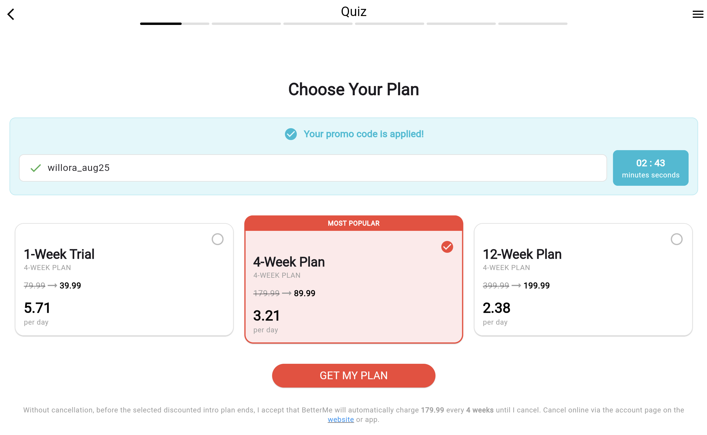
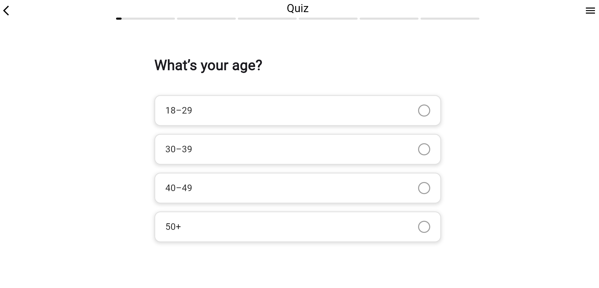
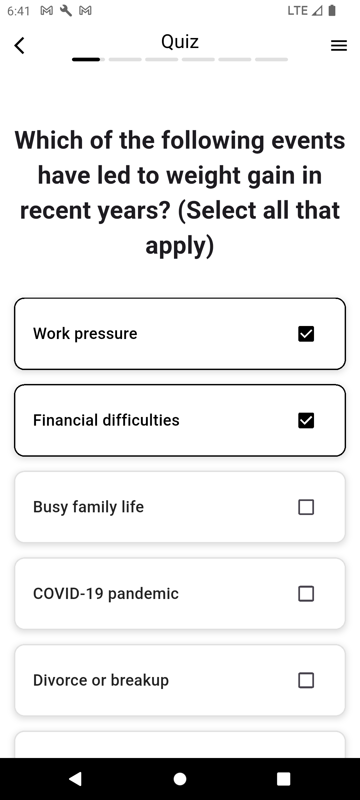

# Quiz Screen – Localization Test

A Flutter quiz screen app with **Russian** 🇷🇺 and **English** 🇺🇸 localization. Loads quiz data dynamically from JSON files: `quiz_en.json` and `quiz_ru.json`.

## 📸 Screenshots
| Web 1 | Web 2 | Mobile |
|-------|-------|--------|
|  |  |  |

## ✨ Features
- Dynamic quiz loading from JSON based on locale
- Two languages: Russian & English
- Responsive for Web and Mobile

## 📂 Structure
assets/  
 ├── quiz_en.json  
 └── quiz_ru.json  
screenshots/  
 ├── web1.png  
 ├── web2.png  
 └── phone.png  

## 🚀 Run
flutter pub get  
flutter run  

## 🌐 Localization
The app detects the current locale and loads the corresponding quiz JSON file.
